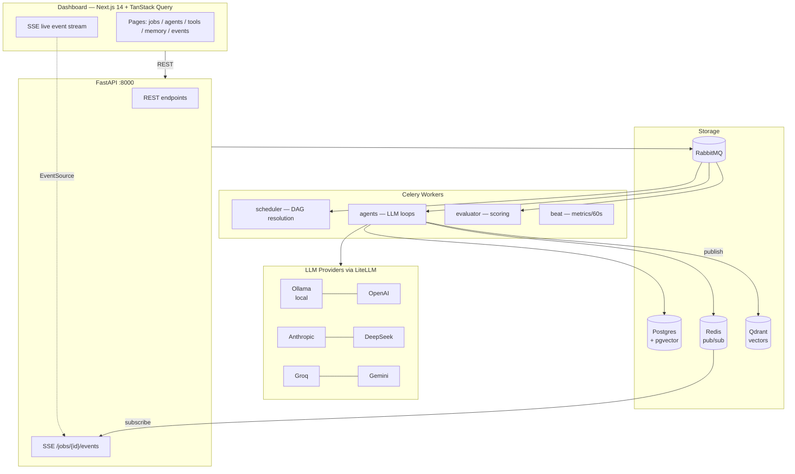
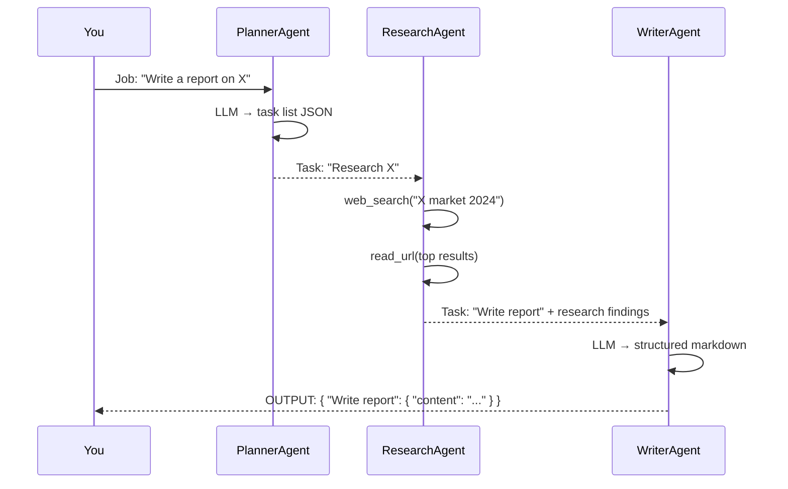

<div align="center">


*"Look on my works, ye Mighty, and dispatch."*

**Multi-agent runtime. Spawn jobs. Watch agents think. Build your own tools.**

[](https://fastapi.tiangolo.com)
[](https://nextjs.org)
[](https://docs.celeryq.dev)
[](https://postgresql.org)
[](https://docs.docker.com/compose)
[](https://github.com/andreisilva1/OSymandias/actions/workflows/tests.yml)


</div>

---

## What is this?

**OSymandias** is a multi-agent runtime that treats AI workloads like an operating system treats processes.

You submit a **job** — a goal in natural language. A PlannerAgent breaks it into tasks. Specialized agents (researcher, writer, analyst) execute each task in parallel or in sequence, calling tools, writing to shared memory, and streaming every event back to a live dashboard.

The result: you see exactly what the agents are thinking, which tools they called, how many tokens they spent — and you can extend the system with your own tools without writing any agent code.

---

## Core concepts

```
Job        →  A user-submitted goal ("research and write a report on X")
  └── Task ×N  →  Subtask assigned to a specific agent type
        └── AgentInstance  →  A running agent loop (LLM + tools + memory)
              └── ToolCall  →  A syscall invocation (web_search, your webhook, ...)
```

**Syscalls** are tools agents can invoke. Built-ins (Python functions) live in the registry. **User-defined syscalls** are webhook endpoints — register a URL and agents will POST to it transparently, no code changes needed.

---

## Architecture



---

## Quick start

**Prerequisites:** Docker, Docker Compose, and one LLM provider.

```bash
# 1. Clone
git clone https://github.com/andreisilva1/OSymandias && cd OSymandias

# 2. Configure
cp .env.example .env
# Edit .env — set at least one provider (see below)

# 3. Start everything
docker compose up -d

# 4. Open the dashboard
open http://localhost:3001
```

### Choosing a provider

| Provider | Setup |
|----------|-------|
| **Ollama** (local, free) | Install [ollama.com](https://ollama.com), run `ollama pull llama3.2`, set `LLM_DEFAULT_PROVIDER=ollama` |
| **OpenAI** | Set `OPENAI_API_KEY=sk-...` |
| **Anthropic** | Set `ANTHROPIC_API_KEY=sk-ant-...` |
| **DeepSeek** | Set `DEEPSEEK_API_KEY=sk-...` |
| **Groq** | Set `GROQ_API_KEY=gsk_...` |
| **Gemini** | Set `GEMINI_API_KEY=AI...` |

> Add a key once, restart Docker once. After that, switch individual agents between providers freely from the UI — no restart needed.

---

## Spawning your first job

Go to the dashboard and click **spawn** (or press `+` in the top bar):

```
Title        →  Market Research Report
Description  →  Research the electric vehicle market in Europe in 2024.
                Summarize key players, market share, and trends.
                Write a structured report with an executive summary.
Priority     →  NORMAL
Payload      →  {}
```

Watch the **Live Event Stream** as agents spin up, call tools, and hand off results to each other. The full output appears in **Processes → [job] → OUTPUT** when complete.

---

## Agent flow



---

## Building a custom syscall (webhook)

No code needed. Register any HTTP endpoint as a tool agents can call:

**1. Register in the UI** (`/tools` → REGISTER):

```
Name:         search_products
Description:  Search the internal product catalog
Webhook URL:  https://your-api.com/ai-tools
Input Schema: { "type": "object", "properties": { "query": { "type": "string" } } }
```

**2. Your server receives:**

```json
POST https://your-api.com/ai-tools
{
  "tool": "search_products",
  "input": { "query": "blue sneakers size 42" }
}
```

**3. Respond with:**

```json
{ "results": [ { "id": "SKU-123", "name": "..." } ] }
```

**4. Assign to an agent** in the Agent Registry → edit panel → Allowed Syscalls.

That's it. Agents call your tool exactly like any built-in.

---

## Dashboard pages

| Page | Path | Description |
|------|------|-------------|
| Dashboard | `/` | Live queue, process table, event stream, resource gauges |
| Processes | `/jobs` | Full job list with status filter. Click → detail view |
| Process detail | `/jobs/{id}` | OVERVIEW · TIMELINE · CALL_GRAPH · EVENT_LOG · SYSCALLS · OUTPUT |
| Agent Registry | `/agents` | Manage agents: system prompts, provider/model, allowed tools |
| Syscall Registry | `/tools` | Built-in and webhook tools |
| Memory Layer | `/memory` | Browse TASK/JOB/GLOBAL memory entries with JSON viewer |
| Event Stream | `/events` | Global audit log with event type filter |
| Metrics | `/metrics` | Aggregated tokens, cost, success rate, job durations |

---

## Useful endpoints

```bash
# Spawn a job
curl -X POST http://localhost:8000/api/v1/jobs \
  -H "Content-Type: application/json" \
  -d '{"title":"My Job","description":"Do X","priority":"NORMAL","input_payload":{}}'

# List available models for a provider (live API query)
curl http://localhost:8000/api/v1/providers/openai/models
curl http://localhost:8000/api/v1/providers/ollama/models

# Register a webhook syscall
curl -X POST http://localhost:8000/api/v1/tools \
  -H "Content-Type: application/json" \
  -d '{"name":"my_tool","description":"...","webhook_url":"https://...","input_schema":{},"output_schema":{}}'
```

Full API reference: **http://localhost:8000/docs**

---

## Troubleshooting

| Symptom | Cause | Fix |
|---------|-------|-----|
| Job stays PLANNING | Worker not consuming queue | `docker compose logs worker-scheduler --tail=30` |
| `APIConnectionError` | Ollama not running or key missing | Start `ollama serve`, or set API key in `.env` and restart |
| Tokens show as 0 | Beat worker hasn't run yet (60s cycle) | Wait 60s and refresh |
| `Vector dimension error` | Embedding model mismatch | `docker compose run --rm migrate` (applies migration 0005) |
| `MaxIterationsExceeded` | Agent looped without producing JSON | Reduce `max_iterations` or improve system prompt |

---

## Repo structure

```
OSymandias/
├── backend/          Python — FastAPI + Celery + agents
│   ├── aios/         Application code
│   └── alembic/      DB migrations (0001 → 0005)
├── frontend/         TypeScript — Next.js 14 dashboard
│   └── src/
├── docker-compose.yml
├── .env.example
└── README.md         ← you are here
```

See [`backend/README.md`](backend/README.md) and [`frontend/README.md`](frontend/README.md) for deeper technical documentation.

---

<div align="center">
<sub>Built with FastAPI · Next.js · Celery · PostgreSQL · Redis · RabbitMQ · Qdrant · LiteLLM</sub>
</div>
